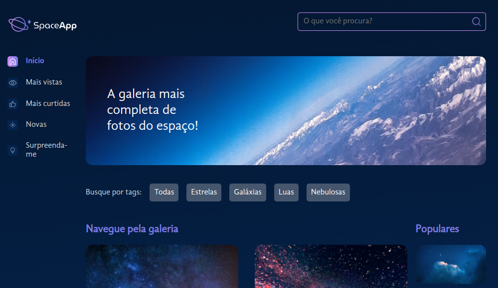
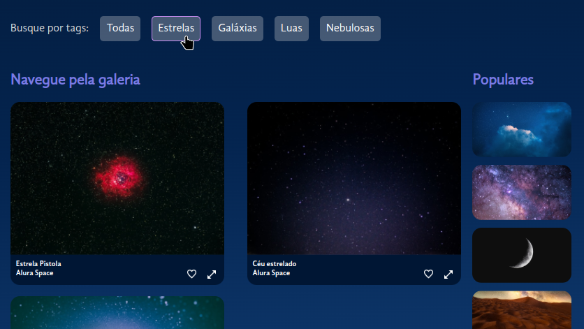
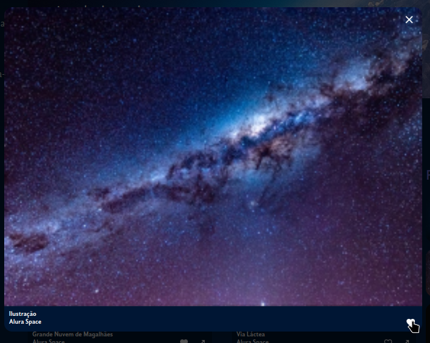

## 🌌 SpaceApp

O **SpaceApp** é uma aplicação que simula uma galeria de fotos do espaço. Com uma interface moderna e responsiva, é possível explorar imagens, aplicar filtros por pesquisa ou tags, ampliar fotos com um clique e ainda favoritar aquelas que mais gostar. Este projeto destaca o uso de **Styled Components** e boas práticas com React.

 

## 🚀 Sobre o Projeto

Este projeto foi desenvolvido durante o curso da Alura:

* "React: estilize componentes com Styled Components e manipule arquivos estáticos"

O SpaceApp é uma galeria interativa de imagens espaciais, onde você pode: explorar imagens em destaque e populares, pesquisar por imagens em tempo real através de uma caixa de busca, filtrar imagens por tags, clicar em uma imagem para vê-la em destaque com detalhes e marcar imagens como favoritas (e removê-las dos favoritos quando quiser).

## 📚 Objetivos do Curso

* Diferenciar o **Vite** do **CRA** e conhecer as vantagens do uso do Styled Components;
* Utilizar **styled-components** para criação de uma NavBar e estilização de um banner;
* Projetar e implementar **componentes React** para exibir imagens e legendas;
* Aplicar **estilos personalizados e acessíveis** para uma galeria de fotos;
* Adicionar uma **barra lateral** de imagens populares e **footer**.

## 🛠️ Tecnologias Utilizadas

## 🖼️ Visualização do Projeto

Uma prévia das principais funcionalidades do **SpaceApp**:

**🌐 Acesse o Projeto Online**

O projeto está disponível para visualização na **Vercel**. Clique no link abaixo para acessar:

**🏠 Página Inicial**

Visualização com as imagens e filtros disponíveis.

**🔍 Busca e Filtros**

Pesquisa e filtragem das imagens em tempo real.

**⭐ Favoritar e Detalhar**

Ampliar imagem, ver detalhes e favoritar.

